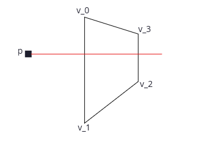

# Projecting a polygon onto a screen

In [cube.py](./console_graphics/cube.py) I am displaying a simple 3D scene where a camera rotates around a cube that is illuminated by a point light source. I am drawing this scene to the terminal using curses. I am writing everything I need to do this from scratch using pure Python, and am hoping to achieve a reasonable frame rate (>20 FPS).

My first pass at the viz loop involved the following:
- Loop over each pixel in the screen
  - Construct a ray from the player position to the pixel in world coordinates
  - Loop over each polygon in the scene and test whether the LOS ray intersects with the poly face
  - Create a list of all polys that the ray intersects, the point of intersection, and the distance to the player
  - For the closest poly, compute the brightness by considering distance to the screen and distance/angle to light source
  - Set the character to display in the pixel based on the computed brightness
  - If no polys intersect the ray, draw a blank space
- Rotate player and player LOS 

I am getting about 2-3 FPS using this method. I'm sure my poly intersection alg could be more efficient, but what is really driving performance is the number of vector calculations I'm performing in each loop, and particularly the poly intersections.

I am planning to optimize my viz loop so that a) I'm doing many fewer tests for intersection and b) those tests are much less expensive. I'm going top do this by projecting each of the polygons in the scene into my screen plane (just projecting the vertices of the polygon). Moreover, I will only calculate projects for polys that are facing toward the camera. If they are facing away from the camera (dot of surface norm vector with the player LOS is >=0) then I will skip them all together. From these projections, I will compute the bounding box for the cube on the screen and only iterate over those pixels. This means I wont be looping over empty screen at all. For the part of the screen that includes the cube, I will test poly intersection using a much simpler test of whether the point is within the 4 line segments defined by the projections into the screen.

The most critical part of this algorithm will be to project each poly face into the screen plane. This document describes how to do that. The projection involves first rotating each vertex into the screen coorinate frame, then translating the coordinate frame to the location of the screen.

## Rotation to screen coordinates

I have a player at some point $\bf{p}_0$ looking in some direction $\hat{\bf{p}}_{los}$, both defined in world coordinates. The world coordinate frame is defined by basis vectors $\left(\hat{\bf{x}}_w,\hat{\bf{y}}_w,\hat{\bf{z}}_w\right)$. For my use case I will assume the player LOS is perpendicular to the $\hat{\bf{z}}_w$ world coordinate. 

My screen coordinate frame will be defined in world coordinates

$\hat{\bf{z}}_{s}=\hat{\bf{p}}_{los}$

$\hat{\bf{y}}_{s}=-\hat{\bf{z}}_w$

$\hat{\bf{x}}_{s}=\hat{\bf{y}}_{s} \times \hat{\bf{z}}_{s}$

To construct a rotation matrix from world to screen coordinates, $R_{sw}$, the columns of the matrix are defined by the basis vectors of the screen coordinates as defined in world coordinates. [See here](http://motion.cs.illinois.edu/RoboticSystems/CoordinateTransformations.html) for a description of calculating a rotation matrix from one coordinate frame to another when you know the unit vectors describing the axes of the target frame represented in the original frame. 

$R_{sw}=\left[\hat{\bf{x}}_{s}^T \, \hat{\bf{y}}_{s}^T \, \hat{\bf{z}}_{s}^T\right]$

$R_{sw}=\begin{bmatrix}x_{sx} & y_{sx} & z_{sx}\\x_{sy} & y_{sy} & z_{sy}\\x_{sz} & y_{sz} & z_{sz}\end{bmatrix}$

This matrix performs the rotation into the screen coordinates, but we can see from the diagram above that the screen is translated from the world coordinate origin. The player in screen coordinates is at $\bf{p}_{0s}=(0, 0, -d_ps)$ where $d_ps$ is the distance from the player to the screen.

$T=\left(0, -h_p, d_{ps}-d_{p0}\right)$

where $h_p$ is the player height and $d_{p0}$ is the distance from the player to the origin.

To project each vertex of a polygon, $\bf{v}$, onto the screen, construct a ray from the player in screen coords ($\bf{p}_{0s}=\left(0, 0, -d_{ps}\right)$) to the vertex in screen coords, then find the point along the ray where z=0. Or more simply, I should just be able to do the ray with the x and y bases (i.e. just take the x and y coordinates).

As a last step, the origin of the screen has to be shifted by half the screen height and width, since the screen origin is not in the center of the screen but in the top left.

## To test if any given pixel is within the projected polygon... 

If we want to test whether the pixel $\bf{p}=\left(p_x, p_y\right)$ in screen coordinates is within a polygon defined by a set of vertices $\bf{v}_i=\left(v_{ix}, v_{iy}\right)$ we can use the [ray casting algorithm](https://en.wikipedia.org/wiki/Point_in_polygon).

We will define a ray along the x coordinate of the screen and check how many edges intersect with the ray. The ray is 

$\bf{p} + \alpha \hat{\bf{x}}$

where $\alpha>=0$. The edge between two vertices is 

$bf{v}_0 + \beta \hat{\bf{v}}_{01}$

where $\hat{\bf{v}}_{01}=\left(\bf{v}_1 - \bf{v}_0\right) / \left|\bf{v}_1 - \bf{v}_0\right|$ and $0<=\beta<=1$.

We can solve for $\alpha$ and $\beta$ with the equations 

$\bf{p} + \alpha \hat{\bf{x}}=bf{v}_0 + \beta \hat{\bf{v}}_{01}$

which gives

$\beta=\left(p_y - v_{0y}\right) / v_{01,y}$

and 

$\alpha=\left(p_y-v_{0y}\right)\left(v_{v01,x}/v_{v01,y}\right) - \left(p_x - v_{0x}\right)$.

If $\alpha$ and $\beta$ meet the boundary conditions above, then the ray intersects with the line segment between two vertices (in this example, vertices 0 and 1). If $v_{01,y}=0$, i.e. the line segment is aligned with the x-axis and parallel to our ray, then the ray does not intersect. If the ray is exactly along the edge of the polygon, i.e. the conditions $p_y=v_{0y}$ and $p_x<v_{0x}$ are met, then we can choose whether to include or exclude the point from the polygon.

Count the number of line segments that intersect. If odd, then the pixel is within the polygon. If even (or 0), it is outside.

## Updated viz loop

- Create empty screen buffer
- Create rotation matrix and translation vector
- Loop over all polygons
  - Check if the polygon is facing the camera by dotting the surface norm with the player LOS, skip if facing away
  - Project each polygon into the screen coordinates according to the transformations above
  - Store the vertex coordinates in the screen plane if one or more vertex is within the screen bounds
- Calculate the bounding box around all vertices in the screen plane
- Loop over pixels within bounding box
  - Check if pixel is within polygon projected into the screen as described above
  - If so, compute the brightness of the pixel (project a ray to the polygon, and from the poly to the light source to get distance to viewer and to the light source)
  - Draw appropriate pixel
- Rotate player and player LOS
